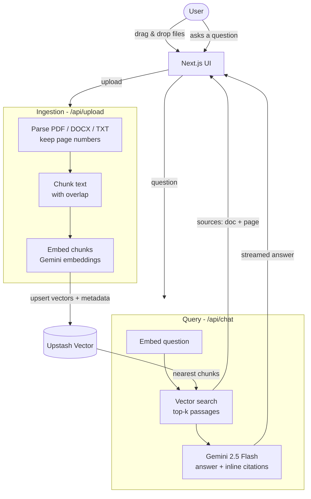

<div align="center">

# 📄 DocChat — Chat with your Documents

**Upload PDFs, Word docs, or text files and ask questions in plain English. Every answer is grounded in your documents and cites the exact source — document name and page number — so you can trust it.**

[](https://nextjs.org/)
[](https://www.typescriptlang.org/)
[](https://ai.google.dev/)
[](https://vercel.com/)
[](LICENSE)

### 🔗 [**Live Demo**](https://chat-with-docs-iota.vercel.app) &nbsp;·&nbsp; built with retrieval-augmented generation (RAG)

</div>

---

## ✨ What it does

DocChat is a production-style **RAG (Retrieval-Augmented Generation)** application. Instead of answering from a model's general knowledge (which can hallucinate), it answers **only from the documents you upload** and shows **where each answer came from**.

- 📥 **Multi-format upload** — PDF, Word (`.docx`), and text (`.txt` / `.md`), several at once via drag-and-drop.
- 🔎 **Grounded answers** — questions are matched against your documents using semantic vector search; the model only sees the most relevant passages.
- 🧾 **Source citations** — every answer includes inline `[1]`, `[2]` markers and clickable source chips showing the **document name + page number**. Click a chip to read the exact passage the answer used.
- 💬 **Real-time streaming chat** — answers stream token-by-token in a clean, modern interface.
- 🔒 **Per-session isolation** — each visitor's documents live in their own vector namespace.
- 💸 **Runs on $0** — Google Gemini's free tier + free hosting tiers. No credit card required.

> 🎬 **[Try the live demo →](https://chat-with-docs-iota.vercel.app)** — upload a document and ask it anything.

<!-- Screenshot added after deployment:  -->


---

## 🏗️ Architecture



### How a question gets answered
1. **Embed the question** with Gemini (`gemini-embedding-001`, `RETRIEVAL_QUERY` task type).
2. **Search** the session's Upstash Vector namespace for the `top-k` most similar chunks (cosine similarity).
3. **Build a grounded prompt** containing only those numbered passages, with strict instructions: answer *only* from context, cite sources inline, and say "I couldn't find that" when the answer isn't present.
4. **Stream** the answer from `gemini-2.5-flash`, and stream the matched **sources** (document + page + snippet) to the UI as structured data parts that render as clickable citations.

---

## 🧰 Tech stack

| Layer | Technology | Why |
|---|---|---|
| Framework | **Next.js 16** (App Router) + React 19 | One deployable full-stack app |
| Language | **TypeScript** | Type-safe end to end |
| Styling | **Tailwind CSS v4** | Fast, consistent, modern UI |
| AI orchestration | **Vercel AI SDK v6** | Streaming, embeddings, provider-agnostic |
| LLM (answers) | **Google Gemini** (2.5 Flash → Flash-Lite) with **Groq** (Llama 3.3 70B) fallback | Multi-key, multi-model failover so the demo never breaks on free-tier limits |
| Embeddings | **Gemini** `gemini-embedding-001` (768-dim) across all keys | Strong retrieval quality, free |
| Vector database | **Upstash Vector** | Serverless, free tier, zero ops |
| Document parsing | **unpdf** (PDF), **mammoth** (DOCX) | Pure-JS, serverless-friendly |
| Hosting | **Vercel** | Free, single-command deploy |

> **Provider-agnostic & resilient by design.** All model calls live in one file ([`src/lib/ai.ts`](src/lib/ai.ts)) and run through a fallback chain: each Gemini key is tried with `gemini-2.5-flash` then `gemini-2.5-flash-lite`, across every key, then **Groq** as a last resort. If one key hits its free-tier limit, the next takes over automatically — so every feature keeps working.

---

## 🚀 Run it locally

### 1. Prerequisites
- Node.js 18.18+ (Node 22 recommended)
- One or more free **Google Gemini API keys** → https://aistudio.google.com/apikey (add several, comma-separated, for automatic failover)
- A free **Groq API key** (final fallback for answers) → https://console.groq.com/keys
- A free **Upstash Vector** index → https://console.upstash.com/vector
  - **Dimensions: `768`** · **Metric: `COSINE`**

### 2. Setup
```bash
git clone <your-repo-url>
cd chat-with-docs
npm install

cp .env.example .env.local   # then paste your keys into .env.local
```

`.env.local`:
```env
# One or more Gemini keys, comma-separated (tried in order, flash then flash-lite)
GOOGLE_API_KEYS=gemini_key_1,gemini_key_2,gemini_key_3
# Final fallback for answers when all Gemini keys are exhausted
GROQ_API_KEY=your_groq_key
UPSTASH_VECTOR_REST_URL=your_upstash_rest_url
UPSTASH_VECTOR_REST_TOKEN=your_upstash_rest_token
```

### 3. Develop
```bash
npm run dev      # http://localhost:3000
```

---

## ☁️ Deploy to Vercel (free)

1. Push this repo to GitHub.
2. Import it at [vercel.com/new](https://vercel.com/new).
3. Add the environment variables from `.env.local` (`GOOGLE_API_KEYS`, `GROQ_API_KEY`, `UPSTASH_VECTOR_REST_URL`, `UPSTASH_VECTOR_REST_TOKEN`) in **Project → Settings → Environment Variables**.
4. Deploy. Vercel gives you a live `https://….vercel.app` URL.

---

## 🎯 Skills demonstrated

- **Retrieval-Augmented Generation (RAG)** end to end: parsing → chunking → embeddings → vector search → grounded generation.
- **Trustworthy AI**: source attribution with document + page citations, and explicit "I don't know" behavior to prevent hallucination.
- **Streaming AI UX** with the Vercel AI SDK (token streaming + structured data parts for citations).
- **Full-stack TypeScript** on Next.js App Router with clean separation of concerns (`lib/` logic, `api/` routes, `components/` UI).
- **Serverless architecture** using managed free tiers (Gemini, Upstash, Vercel) — production-quality with zero infrastructure cost.
- **Pragmatic product design**: drag-and-drop upload, per-session isolation, responsive UI, graceful error handling.

---

## 📁 Project structure

```
src/
├── app/
│   ├── api/
│   │   ├── upload/route.ts      # parse -> chunk -> embed -> upsert
│   │   ├── chat/route.ts        # retrieve -> stream grounded answer + sources
│   │   └── documents/route.ts   # clear a session's documents
│   ├── page.tsx                 # app shell (session, upload, chat state)
│   └── layout.tsx
├── components/                  # Sidebar, Chat, MessageBubble, Sources, UploadZone...
└── lib/
    ├── ai.ts                    # provider config (swap models here)
    ├── vector.ts                # Upstash client + per-session namespaces
    ├── parse.ts                 # PDF / DOCX / TXT extraction (keeps page numbers)
    ├── chunk.ts                 # overlapping text chunking
    └── types.ts                 # shared types
```

---

## 📝 License

[MIT](LICENSE) — free to use, learn from, and build on.
